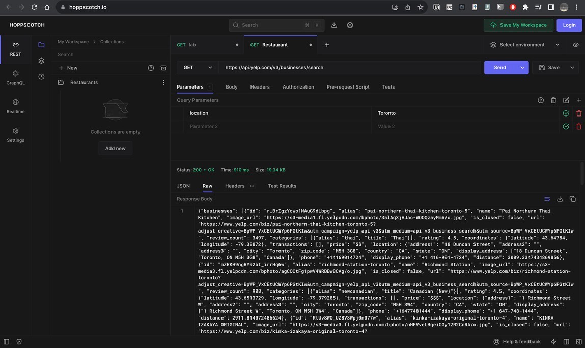
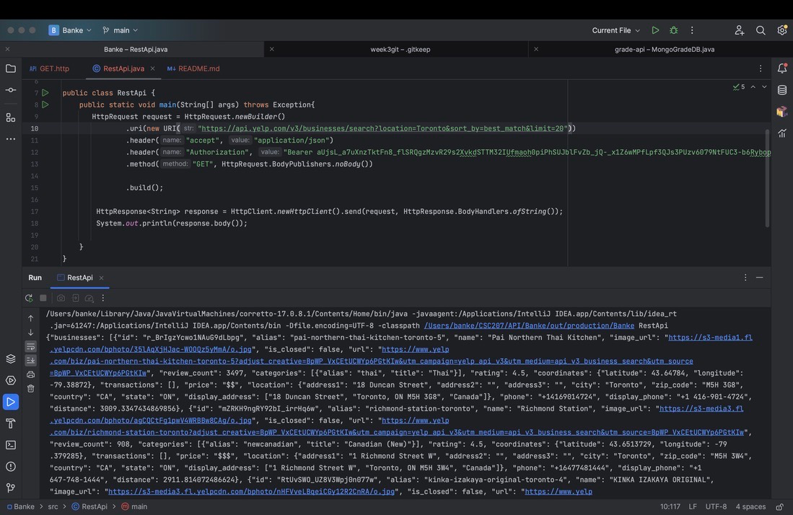

# csc207_groupproject
***
## Domain: _Online Directory_
For our project, we will be creating an **Online Directory** similar to Yelp. Included within the domain will be the
following:
* Information about different items (restaurants, cafés, food trucks, etc.)
* Two different kinds of users (business and personal)
* A message board
* organizational tools to help personal users keep track of places they have recently been to, places they would
  like to visit, and their favourite places
* A review feature
* The ability to set filters when searching

## Application:
The application we are thinking of developing is similar to Yelp, but with extra features. Specifically, the application
is meant to facilitate finding places to eat depending on certain dietary restrictions an individual may have. Currently,
the only filtering options on Yelp (beyond looking something up directly in the search bar) are related to cuisine. The
thought is that business users can register their food spot on our application and choose from a pre-determined list of
filters (ex. Celiac Friendly, Kosher, Halal, Vegan, Vegetarian, etc.) which facilitate searching. Personal users can
choose to review the food spots, and upon doing so will be offered the option to rate (on a scale of one to five) how
true the spot's selected filters are. As such, when filtering one's search, the top results will
reflect the restaurants with the highest rating in that filter. There will also be a message board feature where
personal users can post questions publicly if they are unsuccessful finding somewhere to eat. A personal user can also
create personalized lists titled whatever they like (ex. my favourite gluten-free places, places to go, etc.) and add
food spots to these lists. A personal user has the option of setting their profile to public or private, with public
profiles having their personalized lists accessible by other users. Public users can choose, however, to set their lists
to public or private. 

## API link!: https://docs.developer.yelp.com/docs/fusion-intro 

## Using Hoppscotch to try out the Yelp Fusion API "Search" endpoint
1.

2.
A screenshot of calling the YELP API in https://hoppscotch.io/ :

## Calling the Yelp API in Java
A screenshot of calling the yelp api in Java:

## Technical Problems:

